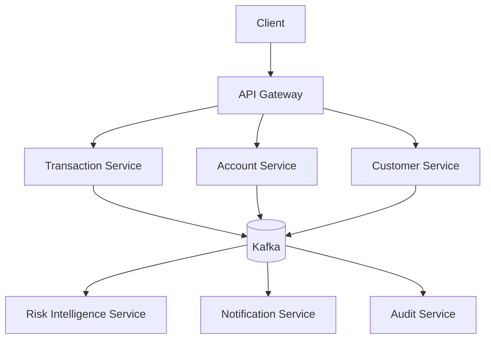
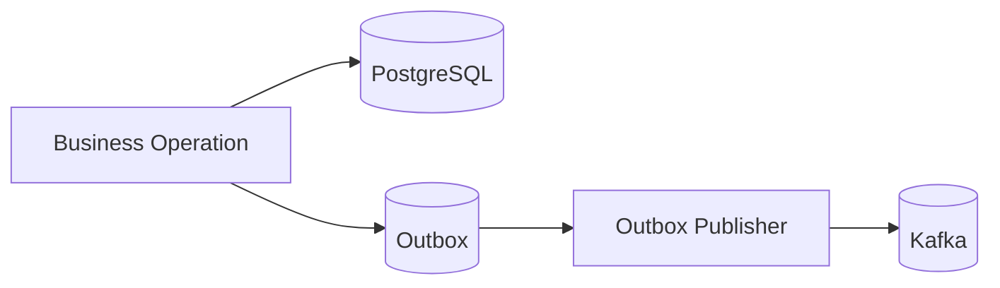
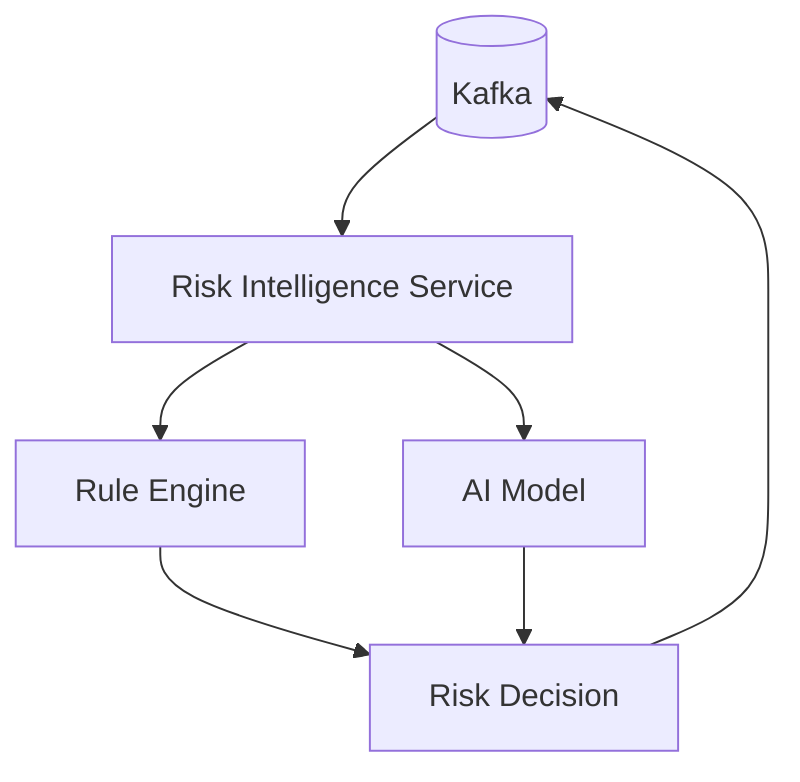
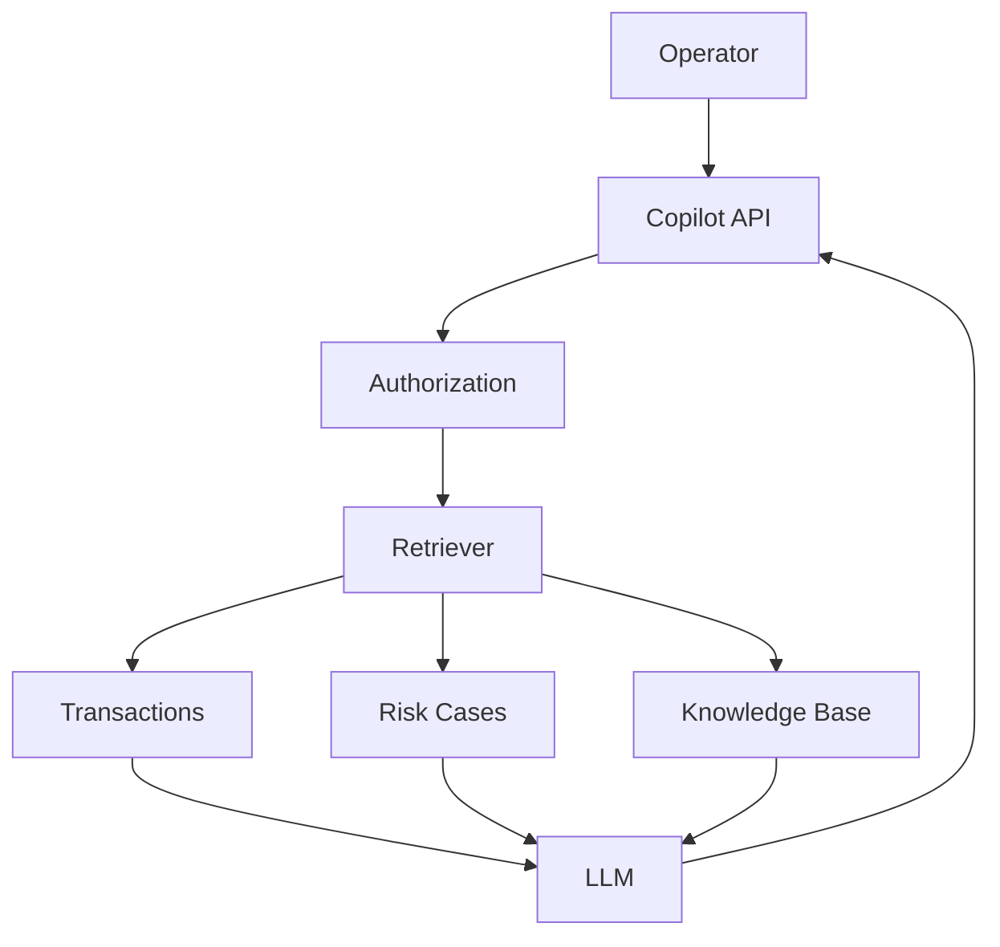
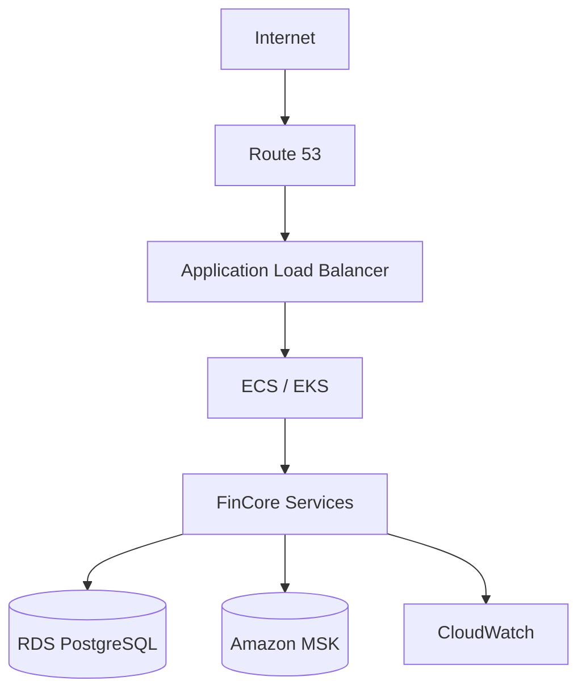

# FinCore

> **Plataforma de Serviços Financeiros Distribuídos com Java, Spring Boot, Kafka, AWS e Inteligência Artificial**

O **FinCore** é um projeto de backend desenvolvido com o objetivo de simular uma plataforma financeira moderna, inspirada em arquiteturas utilizadas por fintechs, bancos digitais e plataformas de pagamentos.

O projeto vai além de operações CRUD e explora problemas reais encontrados em sistemas distribuídos, como **concorrência de saldo, idempotência, consistência distribuída, processamento assíncrono, resiliência, observabilidade, segurança, auditoria e detecção inteligente de risco**.

A arquitetura é construída de forma incremental, começando com os fundamentos de uma aplicação financeira e evoluindo até uma solução baseada em **microsserviços, eventos, cloud e Inteligência Artificial**.

> **Status:** Em evolução.
> Algumas funcionalidades descritas neste README representam a arquitetura-alvo do projeto e são implementadas progressivamente conforme o roadmap.

---

## Objetivo

O FinCore foi criado como um projeto de portfólio para aplicar, de maneira integrada, conhecimentos relacionados ao desenvolvimento de aplicações backend profissionais utilizando o ecossistema Java.

Entre os principais objetivos estão:

* desenvolver APIs REST robustas;
* trabalhar com regras de negócio financeiras;
* modelar sistemas distribuídos;
* resolver problemas reais de concorrência;
* aplicar idempotência em operações financeiras;
* utilizar comunicação síncrona e assíncrona;
* implementar arquitetura orientada a eventos;
* trabalhar com Apache Kafka;
* aplicar padrões de resiliência;
* implementar observabilidade distribuída;
* utilizar conceitos de segurança financeira;
* containerizar aplicações;
* estruturar pipelines de CI/CD;
* realizar deploy em cloud AWS;
* aplicar Kubernetes;
* trabalhar com System Design;
* integrar Inteligência Artificial de forma segura e justificável.

---

# Domínio do sistema

O FinCore simula uma plataforma financeira capaz de gerenciar:

* clientes;
* contas digitais;
* saldos;
* transferências;
* transações;
* beneficiários;
* limites financeiros;
* notificações;
* análise de risco;
* auditoria;
* eventos financeiros;
* investigação de transações suspeitas.

O objetivo não é reproduzir completamente um banco real, mas criar um ambiente suficientemente próximo de sistemas financeiros profissionais para explorar problemas arquiteturais relevantes.

---

# Principais funcionalidades

## Clientes

* cadastro de clientes;
* validação de CPF;
* prevenção de duplicidade;
* bloqueio de clientes;
* consulta de dados cadastrais;
* auditoria de alterações.

## Contas

* criação de contas;
* consulta de conta;
* consulta de saldo;
* bloqueio e desbloqueio;
* encerramento;
* controle de estados.

Estados possíveis:

```text
PENDING
   ↓
ACTIVE
   ↓
BLOCKED
   ↓
ACTIVE
   ↓
CLOSED
```

Contas `BLOCKED` ou `CLOSED` não podem executar movimentações financeiras.

---

# Transferências

Uma transferência possui um ciclo de vida explícito:

```text
CREATED
   ↓
PROCESSING
   ↓
COMPLETED
```

Em caso de erro:

```text
PROCESSING
   ↓
FAILED
```

Também pode ocorrer:

```text
CREATED
   ↓
CANCELLED
```

Antes de uma transferência ser processada, o sistema verifica:

* status da conta;
* saldo disponível;
* limite por operação;
* limite diário;
* limite noturno;
* idempotência;
* regras de segurança;
* regras de risco.

---

# Idempotência

Operações financeiras críticas devem ser idempotentes.

O cliente envia:

```http
Idempotency-Key: 48b2cd31-8ea7-48d8-b889-12c981c5a001
```

A aplicação armazena informações como:

```text
idempotencyKey
requestHash
resourceId
responseStatus
responseBody
createdAt
expiresAt
```

Caso a mesma requisição seja reenviada:

```text
Request
   ↓
Idempotency-Key
   ↓
Já processada?
   ↓
SIM
   ↓
Retorna resultado original
```

Isso evita que problemas como:

* timeout;
* retry;
* perda de conexão;
* clique duplicado;
* reenvio automático;

causem múltiplas movimentações financeiras.

---

# Controle de saldo e concorrência

Um dos principais problemas tratados pelo projeto é o **double spending**.

Exemplo:

```text
Saldo inicial = R$ 1.000

Transferência A → R$ 800
Transferência B → R$ 700
```

As duas operações não podem ser aprovadas simultaneamente.

Sem controle adequado:

```text
Thread A lê saldo = 1000
Thread B lê saldo = 1000

Thread A aprova 800
Thread B aprova 700
```

O sistema utiliza estratégias como:

* transações de banco;
* optimistic locking;
* `@Version`;
* pessimistic locking quando necessário;
* constraints;
* controle de concorrência.

A escolha da estratégia depende do nível de contenção esperado.

---

# Limites financeiros

O sistema possui regras configuráveis de limite.

Valores iniciais utilizados no projeto:

```text
Limite diário                R$ 10.000
Limite por transferência     R$ 5.000
Limite noturno               R$ 2.000
Horário noturno              22:00 - 06:00
```

Os limites devem considerar concorrência para impedir que duas operações simultâneas ultrapassem o valor permitido.

---

# Arquitetura

A arquitetura-alvo utiliza microsserviços com responsabilidades bem definidas.



---

# Microsserviços

## Customer Service

Responsável por:

* clientes;
* dados cadastrais;
* validações;
* status do cliente.

Banco:

```text
customer_db
```

Eventos:

```text
customer.created
customer.updated
customer.blocked
```

---

## Account Service

Responsável por:

* contas;
* saldo;
* limites;
* bloqueios;
* movimentações relacionadas ao agregado financeiro.

Banco:

```text
account_db
```

Eventos:

```text
account.created
account.updated
account.balance.changed
```

---

## Transaction Service

Responsável por:

* transferências;
* transações;
* histórico;
* ciclo de vida financeiro;
* idempotência.

Banco:

```text
transaction_db
```

Eventos:

```text
transaction.created
transaction.processing
transaction.completed
transaction.failed
```

---

## Notification Service

Responsável pelo processamento assíncrono de notificações.

Eventos consumidos:

```text
transaction.completed
transaction.failed
notification.requested
```

---

## Audit Service

Responsável por construir uma trilha de auditoria das operações importantes do sistema.

Informações registradas incluem:

```text
actor
operation
resource
timestamp
result
traceId
correlationId
source
```

---

# Database per Service

Cada microsserviço possui ownership sobre seus próprios dados.

```text
Customer Service
      ↓
customer_db

Account Service
      ↓
account_db

Transaction Service
      ↓
transaction_db

Risk Intelligence
      ↓
risk_db
```

Um serviço **não deve acessar diretamente as tabelas de outro serviço**.

A comunicação ocorre por:

* APIs;
* eventos Kafka.

Esse modelo reduz acoplamento entre serviços e permite evolução independente.

---

# Arquitetura orientada a eventos

O Apache Kafka é utilizado para comunicação assíncrona.

Exemplo:

```text
Transaction Service
        ↓
transaction.created
        ↓
      Kafka
        ↓
 ┌──────┼─────────────┐
 ↓      ↓             ↓
Risk   Audit     Notification
```

---

# Kafka

A escolha do Kafka está relacionada principalmente às seguintes características:

* alto throughput;
* retenção de eventos;
* replay;
* consumer groups;
* escalabilidade;
* particionamento;
* ordenação por chave;
* múltiplos consumidores independentes.

Alguns tópicos utilizados:

```text
transaction.created
transaction.processing
transaction.completed
transaction.failed

account.created
account.updated

risk.analysis.completed
transaction.risk.detected

notification.requested

audit.created
```

---

# Kafka vs RabbitMQ

O projeto avalia explicitamente quando utilizar Kafka ou RabbitMQ.

Kafka foi escolhido como tecnologia principal devido à necessidade de:

* histórico de eventos;
* replay;
* múltiplos consumidores;
* processamento orientado a eventos;
* particionamento;
* escalabilidade.

RabbitMQ poderia ser mais adequado em cenários fortemente orientados a:

* filas;
* work queues;
* roteamento utilizando exchanges.

O objetivo é evitar utilizar uma tecnologia apenas por popularidade.

---

# Transactional Outbox

Um problema clássico em sistemas distribuídos acontece quando uma operação precisa:

```text
Commit no banco
+
Publicar evento Kafka
```

Essas duas operações não fazem parte da mesma transação.

Exemplo:

```text
Database Commit
     ↓
SUCCESS

Aplicação falha

Kafka Publish
     ↓
NÃO EXECUTADO
```

O estado foi salvo, mas nenhum evento foi publicado.

Para evitar esse problema, o FinCore utiliza o conceito de **Transactional Outbox**.



A alteração de negócio e a criação do evento são persistidas na mesma transação.

---

# Consistência distribuída

O projeto diferencia operações que exigem consistência forte das que podem aceitar consistência eventual.

## Consistência forte

Utilizada principalmente em:

```text
saldo
débito
crédito
limite financeiro
estado da transferência
```

## Consistência eventual

Pode ser utilizada em:

```text
notificações
auditoria
analytics
projeções
determinadas análises de risco
```

---

# Saga e compensação

Quando uma operação precisa alterar dados pertencentes a múltiplos serviços, uma transação distribuída tradicional não é desejável.

O FinCore estuda o padrão Saga.

Exemplo:

```text
Débito origem
      ↓
SUCCESS
      ↓
Crédito destino
      ↓
FAIL
      ↓
Compensação
      ↓
Crédito na origem
```

Uma compensação não é um rollback técnico.

Ela representa uma **nova operação financeira que desfaz semanticamente o efeito anterior**.

---

# Resiliência

A comunicação entre componentes pode utilizar:

* timeout;
* retry;
* exponential backoff;
* circuit breaker;
* bulkhead;
* rate limiting.

Biblioteca principal:

```text
Resilience4j
```

Retry não é utilizado indiscriminadamente.

Em operações financeiras:

```text
retry
+
ausência de idempotência
=
risco de operação duplicada
```

---

# Dead Letter Queue

Eventos que falham repetidamente podem ser enviados para DLQ.

```text
Kafka
 ↓
Consumer
 ↓
FAIL
 ↓
Retry
 ↓
FAIL
 ↓
Retry
 ↓
FAIL
 ↓
DLQ
```

O reprocessamento deve ser:

* controlado;
* auditável;
* idempotente;
* observável.

---

# FinCore Intelligence Layer

Como evolução da arquitetura, o FinCore incorpora Inteligência Artificial aplicada ao domínio financeiro.

A IA não possui autoridade para movimentar dinheiro.

O princípio utilizado é:

```text
IA
 ↓
Analisa
 ↓
Classifica
 ↓
Recomenda
 ↓
Sistema aplica regras determinísticas
 ↓
Decisão
```

Nunca:

```text
IA
 ↓
Executa transferência
```

A IA é tratada como um **componente probabilístico dentro de um sistema determinístico**.

---

# Risk Intelligence Service

O `Risk Intelligence Service` combina:

```text
Rule Engine
+
Machine Learning
```

Arquitetura:



---

# Risk Score

Cada transação pode receber um `riskScore`.

```text
0 - 30     LOW
31 - 60    MEDIUM
61 - 80    HIGH
81 - 100   CRITICAL
```

Comportamento:

```text
LOW
→ operação continua

MEDIUM
→ operação continua com monitoramento adicional

HIGH
→ validações adicionais

CRITICAL
→ revisão ou bloqueio temporário
```

Os thresholds devem ser configuráveis.

---

# Features utilizadas pelo modelo

O modelo pode considerar características como:

```text
valor da transação
média histórica do cliente
desvio padrão dos valores
transações na última hora
transações nas últimas 24 horas
horário
dia da semana
novo beneficiário
idade da relação com beneficiário
mudança recente de dispositivo
canal da operação
frequência de transferências
distância do comportamento histórico
```

---

# Feature Engineering

Um valor isolado possui pouco contexto:

```text
amount = 9000
```

Com dados históricos:

```text
amount = 9000

customer_average = 250

amount_vs_average = 36x
```

O modelo passa a identificar que aquela operação é significativamente diferente do comportamento habitual.

---

# Estratégia de Inteligência Artificial

O projeto considera três possibilidades.

## Modelo local

Exemplos:

```text
Isolation Forest
Logistic Regression
Random Forest
XGBoost
```

Possível arquitetura:

```text
Risk Intelligence Service
        ↓
AI Model Service
        ↓
Python + FastAPI
        ↓
ML Model
```

Java continua sendo a stack principal.

---

## AWS SageMaker

Como evolução cloud:

```text
Risk Intelligence Service
        ↓
SageMaker Endpoint
        ↓
Model
```

Permite separar:

* treinamento;
* versionamento;
* hosting;
* inferência.

---

## Modelo externo

Também pode existir um adapter para consumir modelos externos.

O domínio não deve depender diretamente do fornecedor.

---

# Arquitetura Hexagonal aplicada à IA

O domínio trabalha com portas.

Exemplo:

```java
public interface RiskAnalysisPort {

    RiskAnalysisResult analyze(
        RiskAnalysisRequest request
    );

}
```

Adapters podem implementar diferentes tecnologias:

```text
LocalModelAdapter

SageMakerRiskAdapter

ExternalModelAdapter
```

Assim:

```text
Domain
   ↓
RiskAnalysisPort
   ↓
Adapter
   ↓
AI Provider
```

O fornecedor pode ser alterado sem modificar regras centrais de negócio.

---

# Explainable AI

Em um sistema financeiro:

```text
riskScore = 92
```

não é uma explicação suficiente.

O sistema deve registrar motivos.

Exemplo:

```text
RiskScore: 92

+35 → valor muito superior à média
+20 → novo beneficiário
+18 → horário incomum
+12 → alta frequência
+7  → novo dispositivo
```

As razões devem vir de:

* features;
* regras;
* explicabilidade do modelo.

Um LLM nunca deve inventar justificativas.

---

# Human-in-the-loop

Transações classificadas como críticas podem gerar um `RiskCase`.

```text
AI
 ↓
CRITICAL
 ↓
RiskCase
 ↓
Analyst
 ↓
Approve / Reject
```

Estados:

```text
OPEN
UNDER_REVIEW
APPROVED
REJECTED
CLOSED
```

---

# Feedback Loop

Decisões humanas podem retroalimentar o sistema.

```text
Modelo classifica suspeita
        ↓
Analista investiga
        ↓
Fraude confirmada
        ↓
Resultado armazenado
        ↓
Dataset futuro
        ↓
Novo modelo
```

Isso permite evolução gradual do modelo.

---

# Model Drift

Comportamentos financeiros mudam ao longo do tempo.

Um modelo antigo pode começar a gerar:

* falsos positivos;
* falsos negativos;
* perda de recall;
* alteração na distribuição de scores.

Por isso são monitoradas métricas como:

```text
precision
recall
F1-score
false-positive-rate
false-negative-rate
prediction distribution
```

---

# MLOps

O projeto também introduz conceitos básicos de MLOps.

```text
Dataset
   ↓
Training
   ↓
Model
   ↓
Model Registry
   ↓
Deploy
   ↓
Inference
   ↓
Monitoring
   ↓
New Version
```

Cada decisão deve possuir informações como:

```text
modelName
modelVersion
predictionTimestamp
riskScore
inputVersion
```

Assim é possível responder futuramente:

> Qual versão do modelo produziu essa classificação?

---

# Fallback da IA

O sistema não deve depender cegamente do modelo.

Exemplo:

```text
AI Service
   ↓
UNAVAILABLE
   ↓
Rule Engine
   ↓
Decision
```

Outra possibilidade:

```text
AI indisponível

        ↓

Operações de baixo risco
        ↓
continuam

Operações críticas
        ↓
revisão manual
```

---

# Financial Operations Copilot

Como evolução do projeto, o FinCore possui uma proposta de **Copilot operacional** para auxiliar investigações.

Exemplo de pergunta:

```text
Por que a transferência 8f84... recebeu risco crítico?
```

Resposta esperada:

```text
RiskScore: 87

Principais fatores:

- valor muito superior à média histórica;
- beneficiário recém-cadastrado;
- frequência elevada de transferências;
- operação em horário incomum.
```

Esses dados devem vir de informações reais armazenadas pelo sistema.

O LLM não deve inventar justificativas.

---

# RAG

O Copilot utiliza Retrieval-Augmented Generation.



Para dados estruturados:

```text
transações
contas
clientes
risk cases
```

o sistema utiliza consultas tradicionais.

Vector search é reservado para:

```text
documentação
procedimentos
runbooks
políticas
base de conhecimento
incidentes
```

---

# Tool Calling

O LLM não acessa diretamente bancos de dados.

Ferramentas controladas pelo backend podem ser expostas.

Exemplo:

```text
getTransaction(transactionId)

getRiskAnalysis(transactionId)

getCustomerTransactionSummary(customerId)

getRiskCase(caseId)
```

Fluxo:

```text
LLM solicita ferramenta
        ↓
Backend valida autorização
        ↓
Backend executa consulta
        ↓
Resultado autorizado
        ↓
LLM gera resposta
```

---

# Segurança da IA

A camada de IA considera riscos como:

* prompt injection;
* indirect prompt injection;
* data leakage;
* hallucination;
* excessive agency;
* insecure output handling;
* unauthorized tool calling;
* sensitive data disclosure;
* denial of service.

Princípio fundamental:

```text
LLM não controla segurança.

Backend controla segurança.
```

Autorização:

```text
User
 ↓
JWT
 ↓
Backend
 ↓
RBAC
 ↓
Authorized Data
 ↓
LLM
```

---

# Proteção contra hallucination

Quando não existem dados suficientes:

```text
Não existem informações suficientes para determinar a causa.
```

O sistema não deve inventar uma justificativa.

O Copilot deve diferenciar:

```text
Fato recuperado
```

de:

```text
Texto gerado pelo modelo
```

---

# Stack tecnológica

## Backend

```text
Java 21
Spring Boot
Spring Web
Spring Data JPA
Spring Security
Spring Validation
Spring Actuator
Spring Kafka
```

## Banco

```text
PostgreSQL
```

## Migrations

```text
Flyway
```

## Mensageria

```text
Apache Kafka
```

## Resiliência

```text
Resilience4j
```

## Testes

```text
JUnit 5
Mockito
Spring Boot Test
Testcontainers
```

## Observabilidade

```text
OpenTelemetry
Prometheus
Grafana
Elasticsearch
Kibana
Jaeger
```

## Containers

```text
Docker
Docker Compose
```

## Orquestração

```text
Kubernetes
```

## Cloud

```text
AWS
```

Serviços avaliados/utilizados:

```text
ECS
EKS
RDS
MSK
S3
ECR
ALB
Route 53
IAM
CloudWatch
Secrets Manager
SageMaker
Bedrock
```

## IA

```text
Python
FastAPI
scikit-learn
```

ou serviços gerenciados AWS.

---

# Observabilidade

Cada operação deve possuir rastreabilidade.

Exemplo:

```text
Client
 ↓
API Gateway
 ↓
Transaction Service
 ↓
Kafka
 ↓
Risk Intelligence
 ↓
Audit
```

Campos importantes:

```text
traceId
spanId
correlationId
service
operation
timestamp
```

Nunca registrar:

```text
senhas
tokens
credenciais
CPF completo
dados financeiros sensíveis desnecessários
```

---

# Métricas

Algumas métricas monitoradas:

```text
http_requests_total

http_request_duration

transfer_success_total

transfer_failure_total

kafka_consumer_lag

database_connection_pool

outbox_pending_total

dlq_messages_total
```

Métricas de IA:

```text
ai_inference_total

ai_inference_duration_seconds

ai_inference_error_total

risk_high_total

risk_critical_total

model_prediction_distribution

manual_review_total
```

---

# Segurança

O projeto utiliza conceitos como:

* OAuth2;
* JWT;
* RBAC;
* TLS;
* proteção de endpoints;
* criptografia;
* secret management;
* least privilege;
* mascaramento de dados;
* proteção de informações sensíveis.

Roles:

```text
CUSTOMER
OPERATOR
ADMIN
AUDITOR
```

---

# Docker

Cada serviço deve possuir seu próprio `Dockerfile`.

Exemplo:

```dockerfile
FROM eclipse-temurin:21-jdk AS build

WORKDIR /workspace

COPY . .

RUN ./mvnw clean package -DskipTests


FROM eclipse-temurin:21-jre

RUN useradd --system --uid 10001 fincore

USER 10001

WORKDIR /app

COPY --from=build /workspace/target/*.jar app.jar

ENTRYPOINT ["java", "-jar", "app.jar"]
```

---

# Ambiente local

O ambiente local será executado utilizando Docker Compose.

Serviços esperados:

```text
PostgreSQL

Kafka

Customer Service

Account Service

Transaction Service

Risk Intelligence Service

Notification Service

Audit Service

Prometheus

Grafana
```

Exemplo:

```bash
docker compose up -d
```

---

# Executando o projeto

## Requisitos

Antes de executar:

```text
Java 21+
Docker
Docker Compose
Maven
Git
```

Clone o projeto:

```bash
git clone <URL_DO_REPOSITORIO>

cd fincore
```

Inicie a infraestrutura:

```bash
docker compose up -d
```

Compile:

```bash
./mvnw clean install
```

Execute um serviço:

```bash
./mvnw spring-boot:run
```

---

# Configuração

Configurações sensíveis devem ser fornecidas por variáveis de ambiente.

Exemplo:

```bash
DB_HOST=localhost

DB_PORT=5432

DB_USERNAME=fincore

DB_PASSWORD=********

KAFKA_BOOTSTRAP_SERVERS=localhost:9092

JWT_ISSUER=...

JWT_AUDIENCE=...
```

Credenciais nunca devem ser versionadas.

---

# Migrations

Flyway é responsável pela evolução do schema.

Exemplo:

```text
V1__create_customers.sql

V2__create_accounts.sql

V3__create_transactions.sql

V4__create_transfers.sql

V5__create_idempotency_keys.sql

V6__create_outbox.sql
```

---

# Testes

## Unitários

```text
JUnit 5
Mockito
```

Foco:

* regras financeiras;
* validações;
* use cases;
* transitions;
* cálculo de limite.

Executar:

```bash
./mvnw test
```

---

## Integração

Utilizando:

```text
Spring Boot Test
Testcontainers
```

Containers:

```text
PostgreSQL
Kafka
```

---

## Concorrência

Cenários testados:

```text
duas transferências simultâneas

saldo insuficiente concorrente

consumo concorrente de limite

optimistic locking
```

---

## Resiliência

Simulações:

```text
PostgreSQL indisponível

Kafka indisponível

timeout

consumer crash

mensagem duplicada

AI Service indisponível
```

---

## Testes de IA

Incluem:

* score inválido;
* modelo indisponível;
* timeout;
* fallback;
* versões diferentes do modelo;
* drift;
* hallucination;
* prompt injection;
* autorização de tools.

---

# Testes de carga

Ferramentas consideradas:

```text
k6
Gatling
JMeter
```

Cenários:

```text
100 TPS

500 TPS

1.000 TPS
```

Métricas analisadas:

* p50;
* p95;
* p99;
* throughput;
* error rate;
* CPU;
* memória;
* conexões de banco;
* Kafka consumer lag.

---

# CI/CD

Pipeline:

```text
Checkout
   ↓
Build
   ↓
Unit Tests
   ↓
Integration Tests
   ↓
Static Analysis
   ↓
Security Scan
   ↓
Docker Build
   ↓
Push Image
   ↓
Deploy
   ↓
Smoke Tests
   ↓
Monitoring
```

---

# AWS

Arquitetura cloud conceitual:



---

# Estrutura do repositório

Estrutura planejada:

```text
fincore/
│
├── README.md
│
├── architecture/
│   ├── diagrams/
│   └── system-design/
│
├── adr/
│
├── docs/
│   ├── api/
│   ├── runbooks/
│   └── security/
│
├── services/
│   │
│   ├── customer-service/
│   ├── account-service/
│   ├── transaction-service/
│   ├── risk-intelligence-service/
│   ├── notification-service/
│   └── audit-service/
│
├── ai/
│   └── ai-model-service/
│
├── docker/
│
├── docker-compose.yml
│
├── k8s/
│
├── terraform/
│
└── .github/
    └── workflows/
```

---

# Architecture Decision Records

As principais decisões arquiteturais são documentadas através de ADRs.

```text
ADR-001 — Microsserviços

ADR-002 — PostgreSQL

ADR-003 — Kafka vs RabbitMQ

ADR-004 — Database per Service

ADR-005 — Transactional Outbox

ADR-006 — Idempotência

ADR-007 — Observabilidade

ADR-008 — ECS vs EKS

ADR-009 — AI Risk Analysis

ADR-010 — Rule Engine + Machine Learning

ADR-011 — Synchronous vs Asynchronous AI

ADR-012 — AI Model Hosting

ADR-013 — Generative AI Provider

ADR-014 — RAG Architecture

ADR-015 — AI Security

ADR-016 — Human-in-the-loop

ADR-017 — Model Observability
```

---

# Roadmap

## Fase 1 — Core

* [ ] Customer Service
* [ ] Account Service
* [ ] saldo
* [ ] transferência
* [ ] PostgreSQL
* [ ] Flyway
* [ ] testes

## Fase 2 — Microsserviços

* [ ] separar bounded contexts
* [ ] Database per Service
* [ ] APIs independentes
* [ ] Docker

## Fase 3 — Event-driven

* [ ] Kafka
* [ ] eventos
* [ ] consumer groups
* [ ] idempotência
* [ ] Transactional Outbox
* [ ] DLQ

## Fase 4 — Segurança

* [ ] Spring Security
* [ ] OAuth2
* [ ] JWT
* [ ] RBAC
* [ ] ownership
* [ ] secrets

## Fase 5 — Resiliência

* [ ] timeout
* [ ] retry
* [ ] circuit breaker
* [ ] bulkhead
* [ ] rate limiting

## Fase 6 — Observabilidade

* [ ] logs estruturados
* [ ] métricas
* [ ] tracing
* [ ] correlation ID
* [ ] dashboards
* [ ] alertas

## Fase 7 — Cloud

* [ ] AWS
* [ ] RDS
* [ ] ECS
* [ ] ALB
* [ ] IAM
* [ ] Secrets Manager
* [ ] CloudWatch

## Fase 8 — Kubernetes

* [ ] EKS
* [ ] Deployment
* [ ] Services
* [ ] Health probes
* [ ] HPA

## Fase 9 — AI Risk

* [ ] Risk Intelligence Service
* [ ] Rule Engine
* [ ] riskScore
* [ ] modelo de ML
* [ ] fallback
* [ ] model versioning

## Fase 10 — MLOps

* [ ] model registry
* [ ] monitoring
* [ ] model drift
* [ ] rollback
* [ ] métricas de qualidade

## Fase 11 — Generative AI

* [ ] Financial Operations Copilot
* [ ] RAG
* [ ] tool calling
* [ ] autorização
* [ ] proteção contra hallucination
* [ ] prompt injection protection

---

# Principais desafios técnicos

Este projeto foi propositalmente desenhado para resolver problemas além de CRUD.

Entre os principais desafios estão:

1. impedir transferências duplicadas;
2. resolver concorrência de saldo;
3. garantir idempotência;
4. processar mensagens duplicadas;
5. implementar Transactional Outbox;
6. reprocessar DLQ;
7. detectar consumer lag;
8. implementar circuit breaker;
9. implementar tracing distribuído;
10. realizar deploy na AWS;
11. escalar consumidores Kafka;
12. implementar Risk Intelligence;
13. integrar Machine Learning;
14. criar fallback para IA;
15. versionar modelos;
16. detectar model drift;
17. implementar Human-in-the-loop;
18. implementar RAG;
19. proteger tool calling;
20. proteger contra prompt injection;
21. testar hallucinations;
22. controlar dados enviados para modelos.

---

# Decisões importantes

Alguns princípios utilizados no projeto:

```text
IA não movimenta dinheiro.

Retry não substitui idempotência.

Microsserviço não acessa banco de outro microsserviço.

Kafka não é utilizado apenas por popularidade.

Vector database não é utilizado para dados relacionais apenas porque RAG existe.

LLM não decide autorização.

Backend controla segurança.

Compensação não é rollback distribuído.

Observabilidade faz parte da arquitetura.

Toda decisão técnica precisa existir por um motivo.
```

---

# O que este projeto demonstra

O FinCore foi criado para demonstrar conhecimentos práticos relacionados a:

### Java

* Java moderno;
* POO;
* Collections;
* Streams;
* concorrência;
* records;
* boas práticas.

### Spring

* Spring Boot;
* REST;
* JPA;
* Security;
* Validation;
* Kafka;
* Actuator.

### Banco de dados

* PostgreSQL;
* SQL;
* transações;
* índices;
* locking;
* migrations;
* performance.

### Arquitetura

* microsserviços;
* Clean Architecture;
* Hexagonal Architecture;
* SOLID;
* Design Patterns;
* Event-driven Architecture;
* System Design.

### Sistemas distribuídos

* idempotência;
* consistência;
* concorrência;
* Saga;
* Transactional Outbox;
* retries;
* DLQ;
* tolerância a falhas.

### Cloud e DevOps

* Docker;
* Kubernetes;
* CI/CD;
* AWS;
* Terraform;
* observabilidade.

### AI Engineering

* Machine Learning integrado ao backend;
* risk scoring;
* feature engineering;
* MLOps;
* model versioning;
* model drift;
* Explainable AI;
* Human-in-the-loop;
* RAG;
* LLM;
* tool calling;
* AI Security.

---

# Motivação

O principal objetivo do FinCore não é apenas demonstrar conhecimento em várias tecnologias.

A proposta é demonstrar capacidade de responder perguntas como:

> Por que essa tecnologia foi utilizada?

> Qual problema ela resolve?

> Quais alternativas existiam?

> Qual foi o trade-off da decisão?

> Como o sistema se comporta quando essa dependência falha?

> Como essa operação é testada?

> Como ela é monitorada?

> Como evitar inconsistência?

> Como escalar essa solução?

Esse tipo de raciocínio representa uma parte importante da evolução de um desenvolvedor backend para níveis mais avançados.

---

# Disclaimer

O FinCore é um projeto educacional e de portfólio.

Ele simula conceitos utilizados em sistemas financeiros, mas **não deve ser utilizado como sistema bancário real ou como referência única para decisões financeiras, regulatórias, jurídicas ou de segurança em produção**.

Valores, limites, políticas de risco e configurações presentes no projeto existem para fins de estudo e demonstração arquitetural.

---

# License

Este projeto é disponibilizado para fins educacionais e de portfólio.

Consulte o arquivo `LICENSE` para mais informações.
